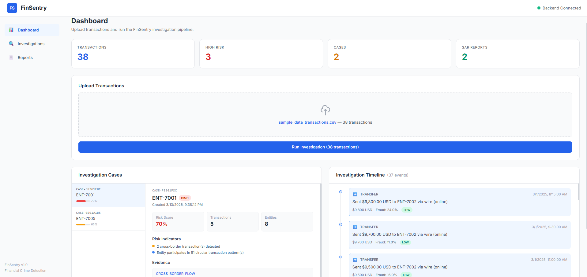
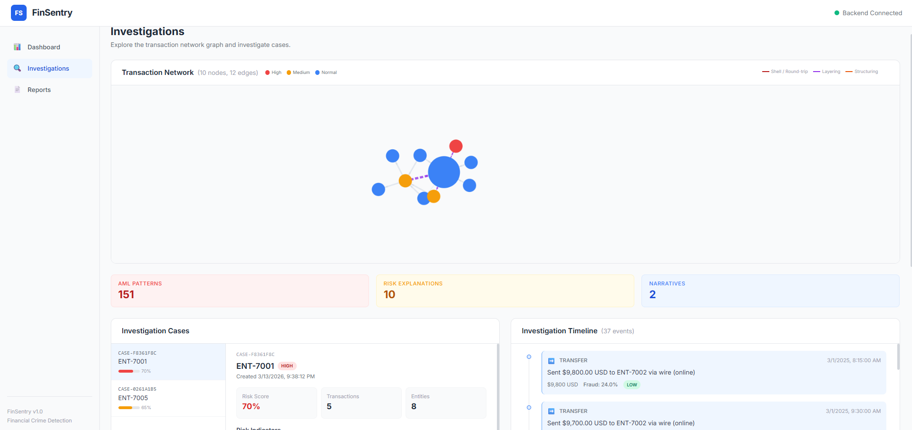
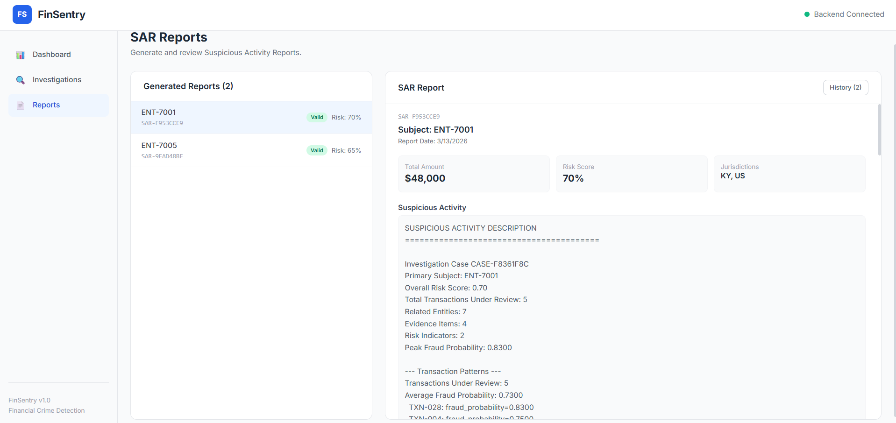

# 🛡️ FinSentry

### Explainable Financial Crime Investigation Platform


> **A financial crime investigation platform for detecting suspicious transactions, analyzing financial networks, and generating regulatory reports.**

FinSentry converts raw transaction datasets into **structured investigation intelligence** using fraud detection models, explainable analytics, graph-based investigation tools, and automated SAR report generation.

---

# 🧠 Overview

Financial institutions process **millions of transactions daily**, making fraud investigation and AML monitoring difficult.

FinSentry provides a complete **investigation pipeline** that allows analysts to:

• detect suspicious transactions
• understand fraud model explanations
• explore transaction networks visually
• identify money laundering patterns
• build investigation cases
• generate Suspicious Activity Reports (SAR)

The platform provides an **interactive investigation dashboard** for financial crime analysts.

---

# 📸 Screenshots

## Dashboard



The dashboard allows investigators to upload transaction datasets and run the full investigation pipeline.

---

## Investigation Graph



The investigation page visualizes the **transaction network**, allowing analysts to explore entity relationships, suspicious flows, and risk scores.

---

## SAR Report



Generated SAR reports summarize suspicious activity, evidence, and regulatory insights.

---

# 🏗 System Architecture

```
Transaction Dataset
        │
        ▼
Fraud Detection
(Isolation Forest + Random Forest)
        │
        ▼
Explainability
(SHAP Feature Attribution)
        │
        ▼
Graph Intelligence
(NetworkX Transaction Graph)
        │
        ▼
AML Pattern Detection
        │
        ▼
Case Builder
        │
        ▼
Investigation Narrative
        │
        ▼
SAR Generator
        │
        ▼
Compliance Validator
        │
        ▼
Investigation Dashboard
```

---

# ✨ Core Features

## 🔍 Fraud Detection

Transactions are analyzed using machine learning models:

• Isolation Forest
• Random Forest

Each transaction receives a **fraud probability score** and risk classification.

---

## 🧠 Explainable Risk Analysis

FinSentry integrates **SHAP** to explain fraud predictions.

Investigators can view:

• feature importance
• anomaly drivers
• entity-level risk explanations

This enables **transparent and auditable decision-making**.

---

## 🕸 Graph-Based Investigation

Financial crime often occurs across **networks of transactions**.

FinSentry builds a transaction graph where:

• nodes represent entities
• edges represent financial transfers

Graph analytics include:

• degree centrality
• PageRank
• community detection
• cycle detection
• suspicious transfer chains

---

## 🚨 AML Pattern Detection

The system automatically detects common AML typologies:

• structuring
• layering
• round-tripping
• rapid transfers
• shell company clusters

Each detection includes **investigator-friendly explanations**.

---

## 🗂 Case Builder

Suspicious transactions are grouped into **investigation cases** containing:

• involved entities
• suspicious transactions
• AML patterns detected
• evidence and indicators
• narrative explanations

---

## 📑 SAR Report Generation

FinSentry generates **Suspicious Activity Reports** automatically.

Reports include:

• suspicious activity description
• transaction evidence
• risk assessment
• jurisdiction analysis
• entities involved

Generated SAR reports are **stored and retrievable**.

---

# 💾 SAR Report Storage

Available endpoints:

| Endpoint               | Description             |
| ---------------------- | ----------------------- |
| GET `/sar/list`        | List stored SAR reports |
| GET `/sar/{report_id}` | Retrieve SAR report     |

This allows investigators to **review historical reports**.

---

# 🖥 Investigation Dashboard

### Upload Panel

Upload transaction datasets.

### Fraud Table

Displays suspicious transactions with fraud scores.

### Graph Investigation

Interactive network graph showing suspicious transaction flows.

### Entity Profile

Shows entity risk metrics and connected entities.

### Case Viewer

Displays investigation cases and AML patterns.

### SAR Viewer

Generate and browse SAR reports.

---

# ⚙️ Tech Stack

### Backend

Python
FastAPI
Pydantic
scikit-learn
SHAP
NetworkX
SQLAlchemy

---

### Frontend

React
TypeScript
Vite
TailwindCSS
react-force-graph

---

### Testing

pytest

**326 automated tests**

---

# 📡 API Endpoints

| Endpoint                  | Description                  |
| ------------------------- | ---------------------------- |
| POST `/pipeline/run`      | Run investigation pipeline   |
| GET `/case/{case_id}`     | Retrieve investigation case  |
| GET `/timeline/{case_id}` | Investigation timeline       |
| GET `/graph/{entity_id}`  | Graph metrics for entity     |
| GET `/entity/{entity_id}` | Entity investigation profile |
| POST `/sar/generate`      | Generate SAR report          |
| GET `/sar/list`           | List stored SAR reports      |
| GET `/sar/{report_id}`    | Retrieve SAR report          |

---

# 📂 Project Structure

```
FinSentry/
│
├── agents/
├── aml_patterns/
├── case_builder/
├── compliance_validator/
├── explainability/
├── fraud_detection/
├── graph_engine/
├── graph_rag/
├── ingestion/
├── investigation_narrative/
├── sar_generator/
├── api/
│
├── frontend/
│
├── data/
│   └── sample_data_transactions.csv
│
├── screenshots/
│   ├── dashboard.png
│   ├── investigation.png
│   └── report.png
│
├── tests/
└── requirements.txt
```

---

# ⚙️ Installation

Clone the repository

```bash
git clone https://github.com/parth-shinge/FinSentry.git
cd FinSentry
```

Create virtual environment

```bash
python -m venv venv
```

Activate environment

Mac/Linux

```bash
source venv/bin/activate
```

Windows

```bash
venv\Scripts\activate
```

Install dependencies

```bash
pip install -r requirements.txt
```

---

# ▶️ Running the Backend

Start the API server

```bash
uvicorn api.main:app --reload
```

Backend runs at

```
http://localhost:8000
```

API docs

```
http://localhost:8000/docs
```

---

# ▶️ Running the Frontend

```
cd frontend
npm install
npm run dev
```

Frontend runs at

```
http://localhost:5173
```

---

# 🧪 Demo Workflow

```
1. Upload sample transaction dataset
2. Run investigation pipeline
3. Explore transaction graph
4. Investigate entities and cases
5. Generate SAR report
6. Review stored SAR reports
```

---

# ⭐ Highlights

✔ Explainable fraud detection
✔ Graph-based AML investigation
✔ Automated case generation
✔ SAR report generation and storage
✔ Interactive investigation dashboard

---

# 🏁 Conclusion

FinSentry demonstrates how **fraud detection models, explainable analytics, and graph-based investigation tools** can be integrated into a unified system for **financial crime analysis and AML compliance**.

The platform enables investigators to **identify suspicious networks, build investigation cases, and generate regulatory reports efficiently**.
